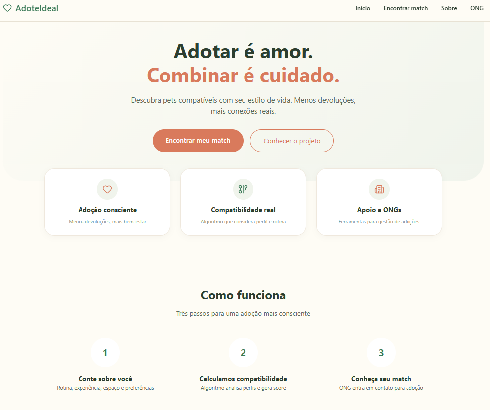
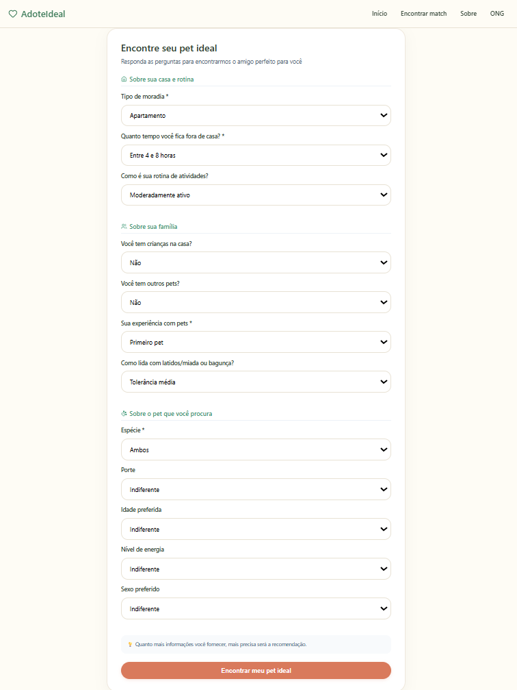
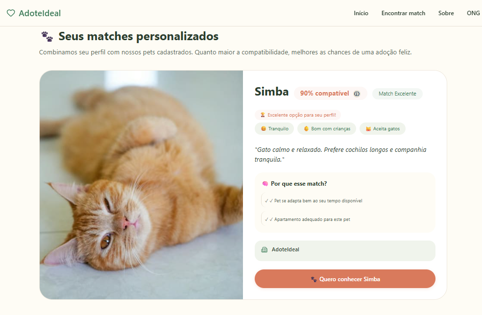

# AdoteIdeal

## Sobre o Projeto

O AdoteIdeal é uma plataforma web desenvolvida para auxiliar organizações de proteção animal na divulgação de animais disponíveis para adoção responsável.

O sistema busca aproximar adotantes e animais por meio de um mecanismo de compatibilidade que considera características dos pets e preferências informadas pelos usuários, contribuindo para adoções mais adequadas e conscientes.

Este projeto foi desenvolvido como parte da Atividade Extensionista II do curso Superior de Tecnologia em Ciência de Dados da UNINTER.

---

## Problema

Organizações de proteção animal frequentemente enfrentam dificuldades para divulgar animais disponíveis para adoção e encontrar adotantes compatíveis com as necessidades de cada pet.

Além disso, adoções realizadas sem considerar fatores comportamentais e o estilo de vida dos adotantes podem aumentar o risco de devoluções.

---

## Objetivo

Desenvolver uma plataforma digital que facilite a divulgação de animais para adoção responsável e auxilie na identificação de compatibilidade entre animais e potenciais adotantes.

---

## Funcionalidades

### Para adotantes

* Responder questionário de perfil.
* Consultar animais compatíveis.
* Visualizar percentual de compatibilidade.
* Demonstrar interesse em um animal.

### Para ONGs e administradores

* Cadastrar animais.
* Editar informações dos animais.
* Remover animais.
* Gerenciar registros disponíveis para adoção.


## Como Funciona a Compatibilidade

O sistema utiliza um algoritmo de compatibilidade baseado na comparação entre características dos animais cadastrados e as preferências informadas pelos adotantes.

São considerados critérios como:

* Porte;
* Faixa etária;
* Nível de energia;
* Sexo;
* Preferências do adotante;
* Compatibilidade com o estilo de vida informado.

Com base nessas informações, é calculado um percentual de compatibilidade para auxiliar na recomendação dos animais mais adequados para cada perfil.

---

## Tecnologias Utilizadas

### Backend

* Python
* Flask

### Banco de Dados

* SQLite
* PostgreSQL

### Frontend

* HTML
* CSS
* JavaScript

### Hospedagem

* Render

### Controle de Versão

* Git
* GitHub

---

## Estrutura do Banco de Dados

O sistema utiliza as seguintes entidades principais:

* ONG
* Animal
* Adotante
* Compatibilidade
* Interesse

Essas entidades permitem armazenar informações dos animais, perfis dos adotantes, resultados de compatibilidade e manifestações de interesse.

---

## Demonstração Online

Acesse a versão publicada:

https://adoteideal.onrender.com/

---

## Capturas de Tela

### Tela Inicial


### Questionário do Adotante


### Resultado de Compatibilidade


---

## Repositório

https://github.com/7ha1/adoteideal

---

## Instalação

Clone o repositório:

```bash
git clone https://github.com/7ha1/adoteideal.git
```

Acesse a pasta do projeto:

```bash
cd adoteideal
```

Instale as dependências:

```bash
pip install -r requirements.txt
```

Execute a aplicação:

```bash
python app.py
```

---

## Estrutura do Projeto

```text
adoteideal/
│
├── app.py
├── models/
├── templates/
├── static/
├── database/
├── requirements.txt
└── README.md
```

---

## Impacto Social

O projeto foi desenvolvido com foco na promoção da adoção responsável e no apoio a organizações de proteção animal.

Durante o desenvolvimento, foram coletados feedbacks de organizações ligadas à causa animal, permitindo identificar desafios reais enfrentados no processo de adoção e validar a relevância da proposta.

---

## Trabalhos Futuros

* Melhorar o processo de cadastro de animais.
* Criar área exclusiva para organizações parceiras.
* Aprimorar o algoritmo de compatibilidade.
* Incorporar técnicas de Ciência de Dados e Machine Learning para recomendações mais precisas.

---

## Autora

Thaillyne Baladei Mattos

Curso Superior de Tecnologia em Ciência de Dados

Centro Universitário Internacional UNINTER
